# Tarea2_InstalacionSGE_IvanLopezBrion
### Instalación ubuntu server:
Para realizar la instalación de wordpress utilcé como sistema operativo base un Ubuntu Server, específicamente la versión LTS 24.04.
Omitiré la explicación de como se realiza este proceso pues lo daré como sabido y no importante en la explicación del proceso de wordpress
Además de la propia instalación de Ubuntu Server instalé la GUI de kubuntu (para esto simplemente instalamos slim que es un gestor de interfaces gráficas y luego utilicé el comando sudo apt install kubuntu-desktop para descargar el entorno gráfico)
### Guía de instalación utilizada: [Cómo instalar Wordpress en 3 minutos Ubuntu 24.04](https://www.youtube.com/watch?v=TequRBpLqLk)
Para realizar la instalación utilicé la siguiente guía en cuestión adecuada a mi versión de Ubuntu Server
### Inicio de la instalación:
En la siguiente imagen se puede observar la versión que anteriormente he detallado que voy a usar
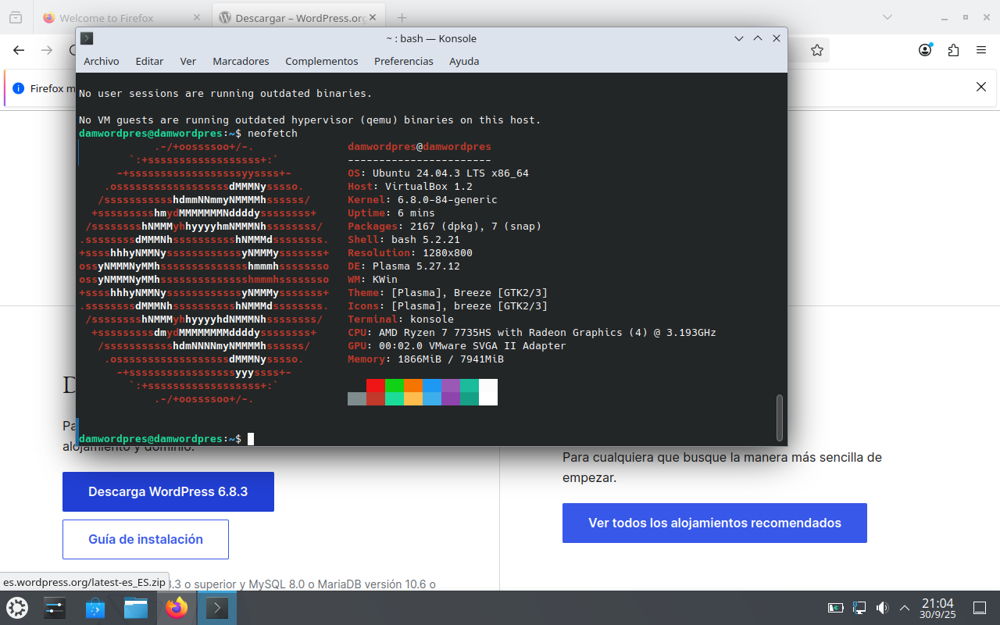

Primeramente instalaremos wordpress, para acceder a la parte de instalaciones tendremos que clicar en versiones pues la descarga que aparece en grande de la pantalla es para Windows
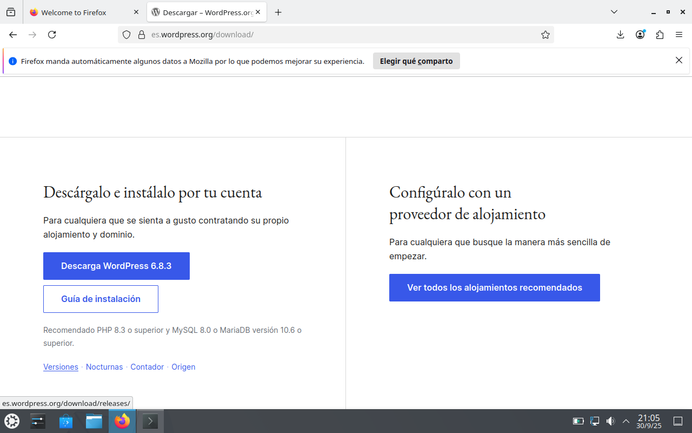

Podremos seleccionar entre 2 opciones de comprimido, .zip y .targz, en mi caso escogí .targz.
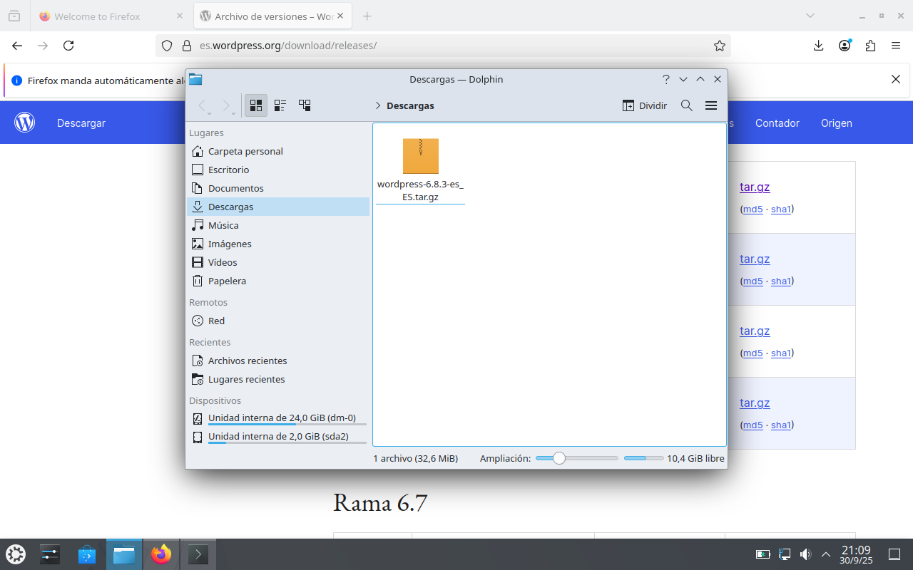

Para después utilizar el contenido de la careta de manera más sencilla cambiaremos el nombre del comprimido a wordpress y luego lo extraeremos
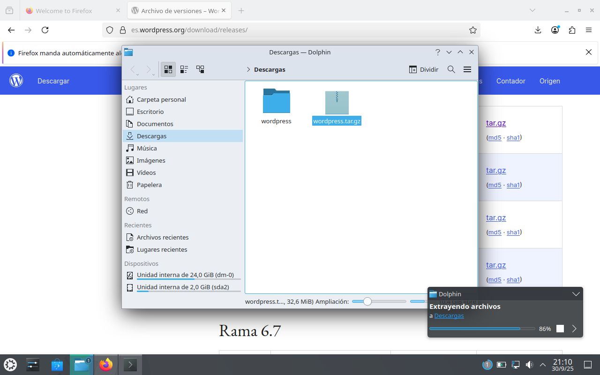

Tras esto instalaremos apache2 y el servidor de mysql con los comandos que se ven en la terminal. (se puede ver que sale que no se han instalado porque me olvidé de hacerle captura cuando lo hice por primera vez)
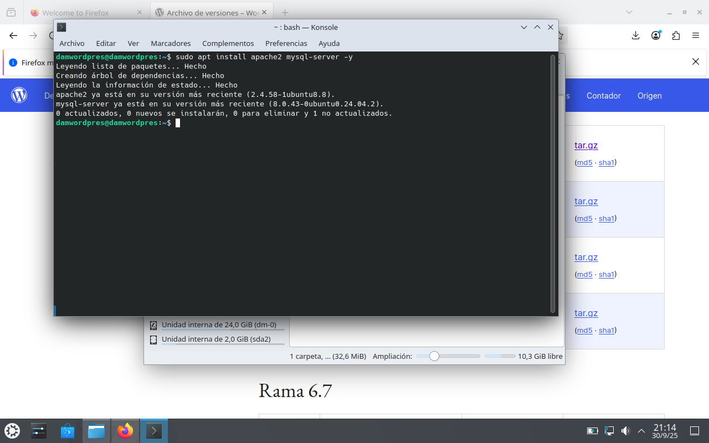

Iniciaremos sesión en root con el comando "su -" en caso de que ya esté definido el usuario root, en caso de que esto no sea así utilizaremos "sudo su".

Ya una vez como root entraremos como root en mysql, para lo cual no nos hará falta contraseña pues por algo somos los administradores del equipo.
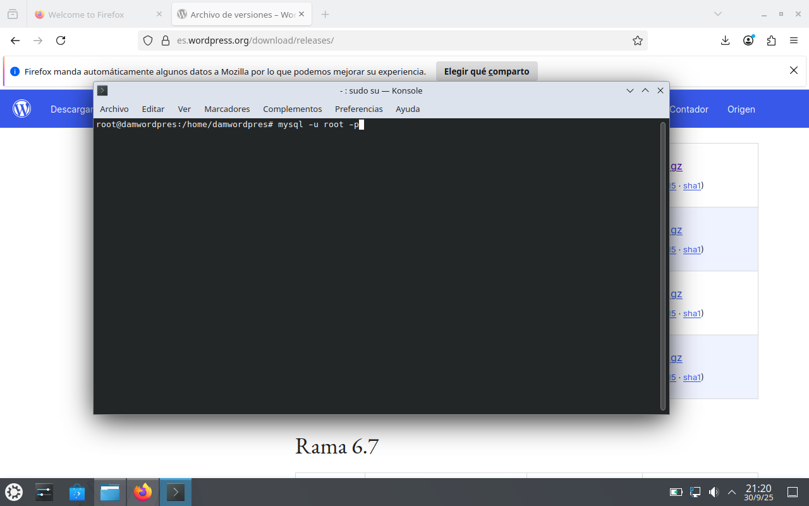

crearemos la base de datos wordpress como se puede observar en la imagen: (si no ponemos ";" la orden no se ejecutará solamente indicando salto de linea)
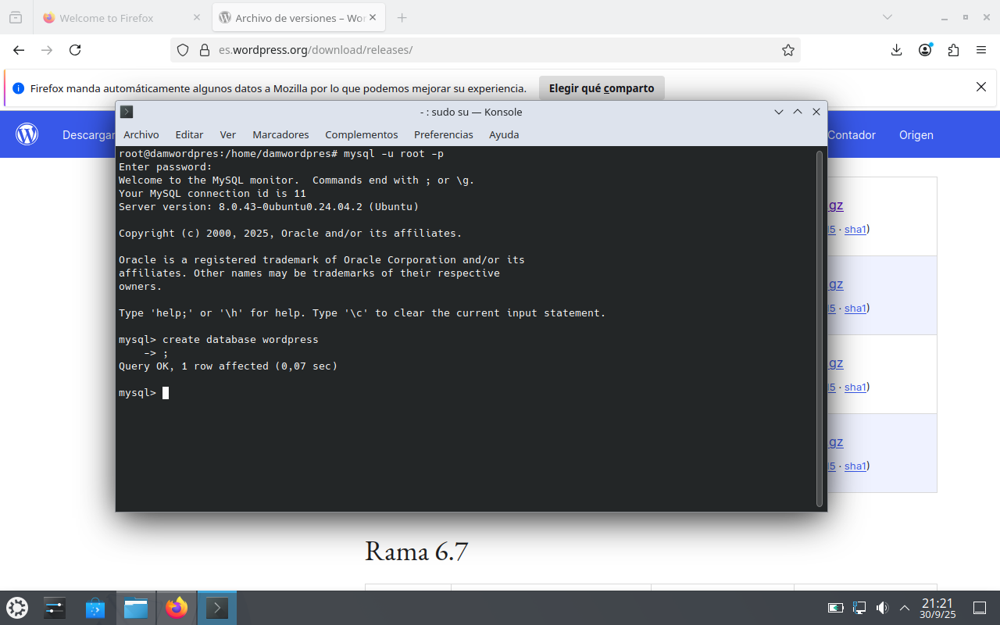

Luego cambiaremos el plugin de autentificación del usuario root al tradicional de mysql, haciendo se consigue mejor compatibilidad con algunas herramientas más antiguas.

Recargamos los privilegios y salimos del gestor mysql.
Procederemos a instalar una serie de dependencias (lo mismo que antes ya las tenía instaladas y se me olvidó hacer capturas por eso tuve que repetir)
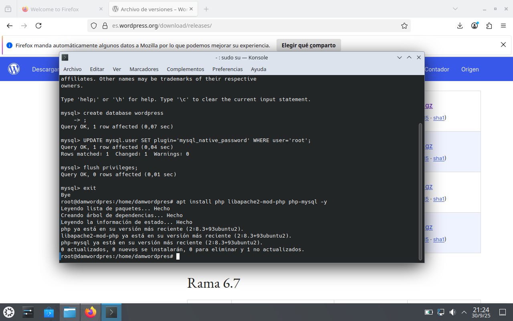

Nos moveremos hasta la carpeta donde tengamos la carpeta de wordpress por la terminal, en mi caso Descargas.
Luego copiaremos la carpeta en cuestión en la dirección /var/www/html/ y todo su contenido con la opción -R (recursivo)

Modificaremos los privilegios de acceso de la siguiente forma:
(No estamos intentando hacer un proceso seguro, simplemente la forma más básica de abrir un wordpress)
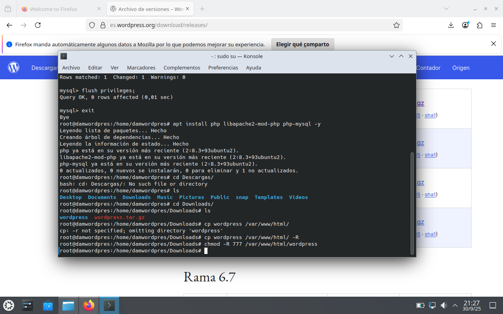

Una vez hecho esto abriremos un navegador a nuestra elección y buscaremos "localhost/wordpress" para abrir nuestro servidor local.
Acto seguido clicaremos en continuar
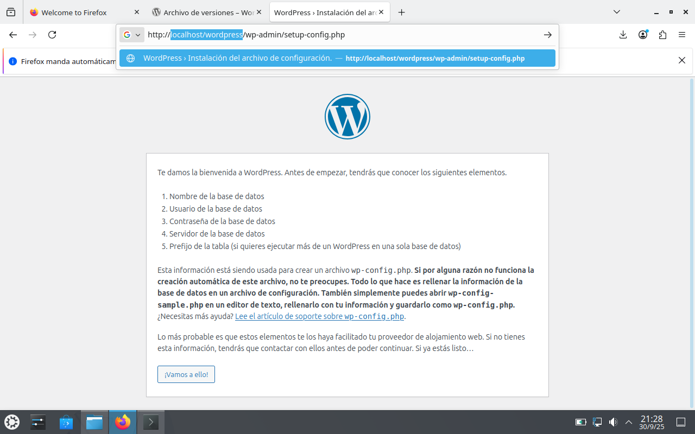

Rellenaremos las siguientes cuestiones (importante recalcar que en este caso no hace falta contraseña pues iniciamos sesión como root, si intentamos iniciar con contraseña como en este caso nos dará error de autentificación)
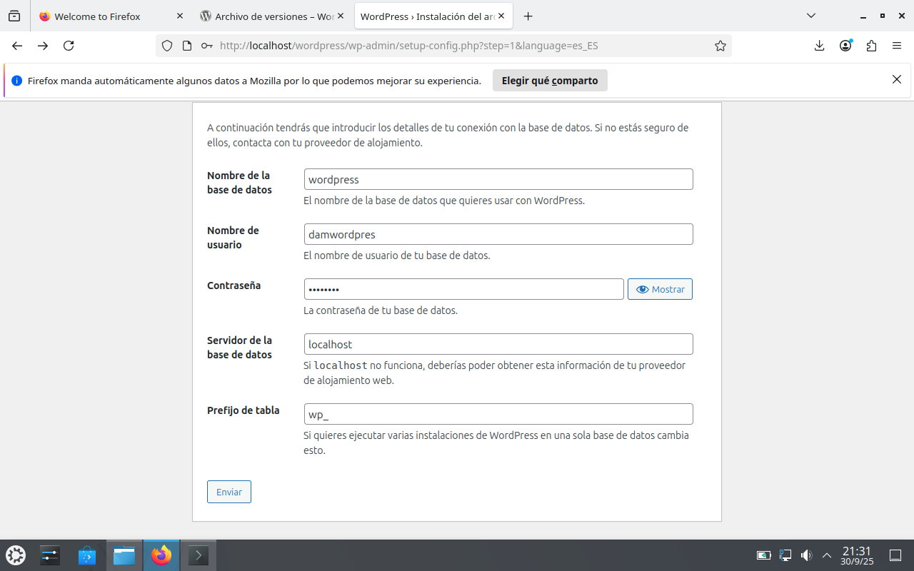

Si hacemos todo bien nos saldrá la siguiente pantalla y simplemente seguiremos adelante
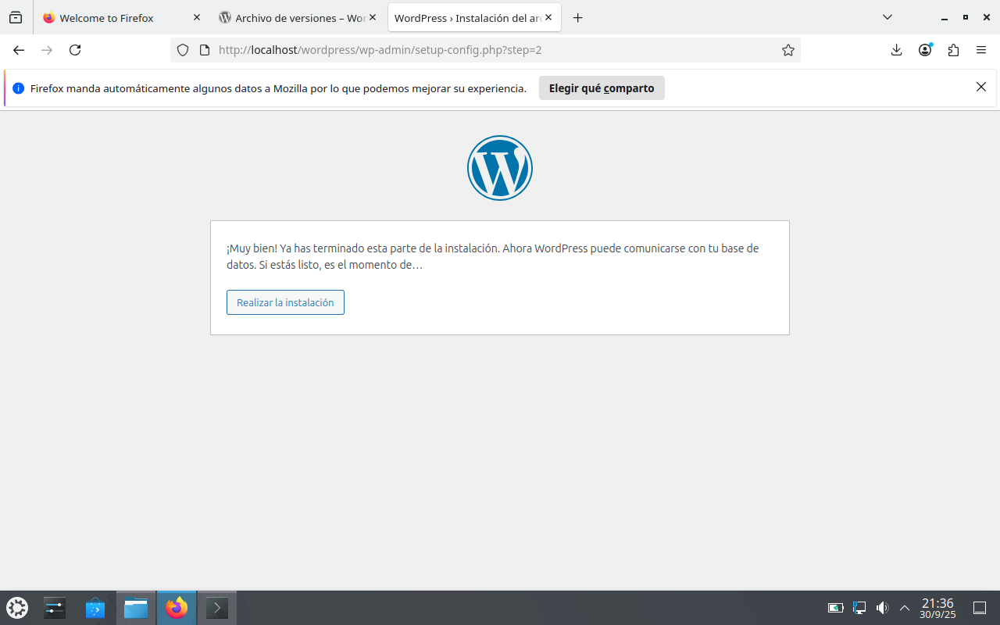

Rellenaremos otra vez los siguientes campos, podremos poner una contraseña poco segura habilitando la opción en la caja de abajo, no es una práctica nada recomendable sino que este es un ejemplo práctico.
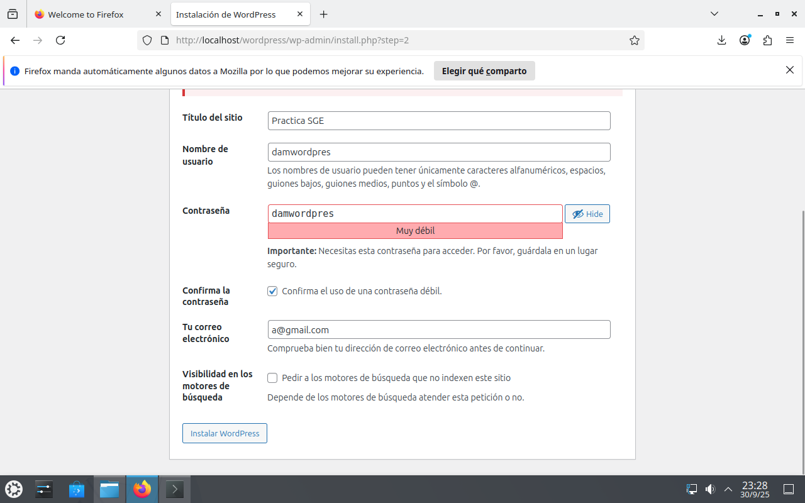

Listo!!!. Wordpress queda instalado y podemos iniciar sesión con los datos que hemos rellenado anteriormente.
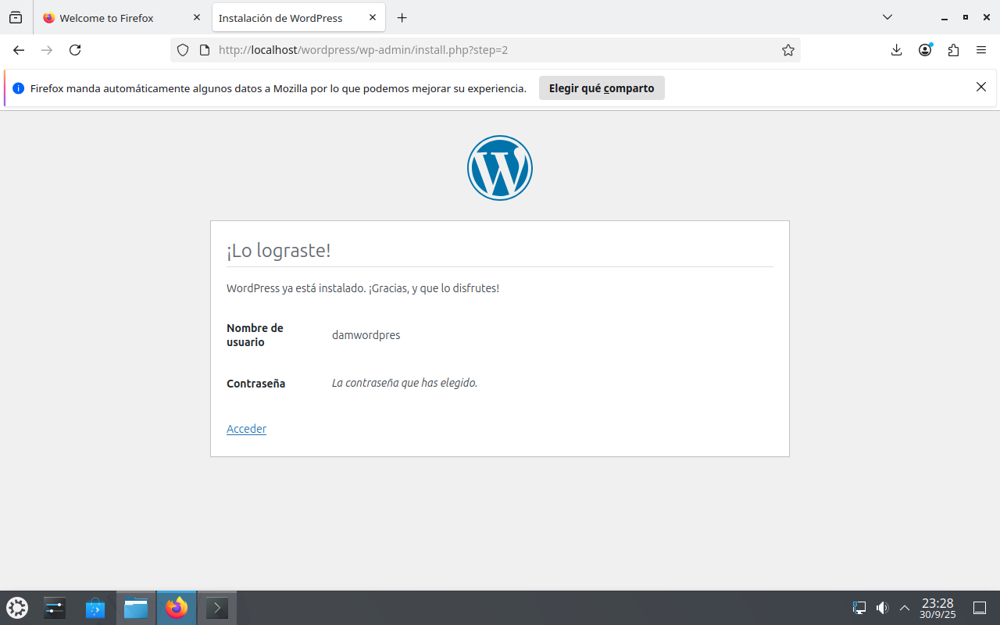
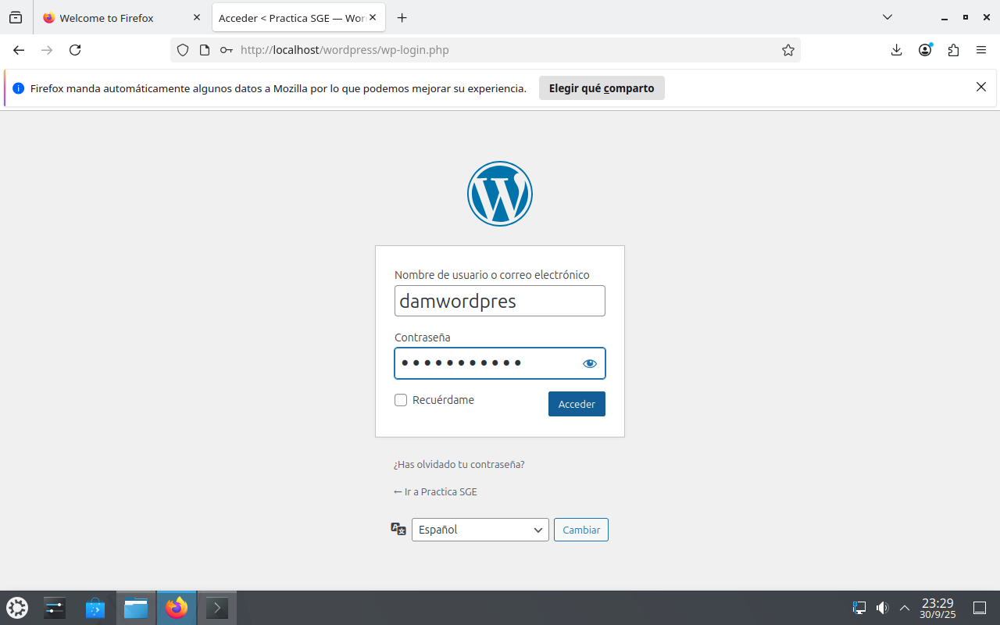
